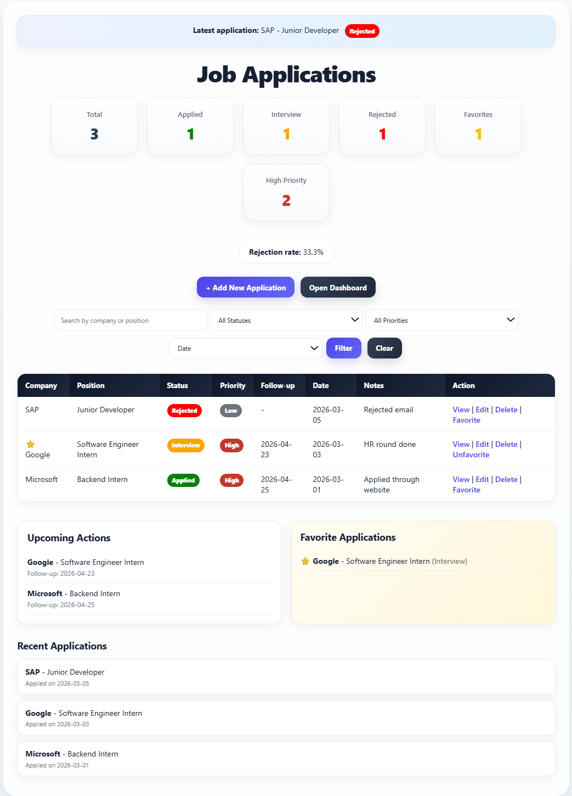
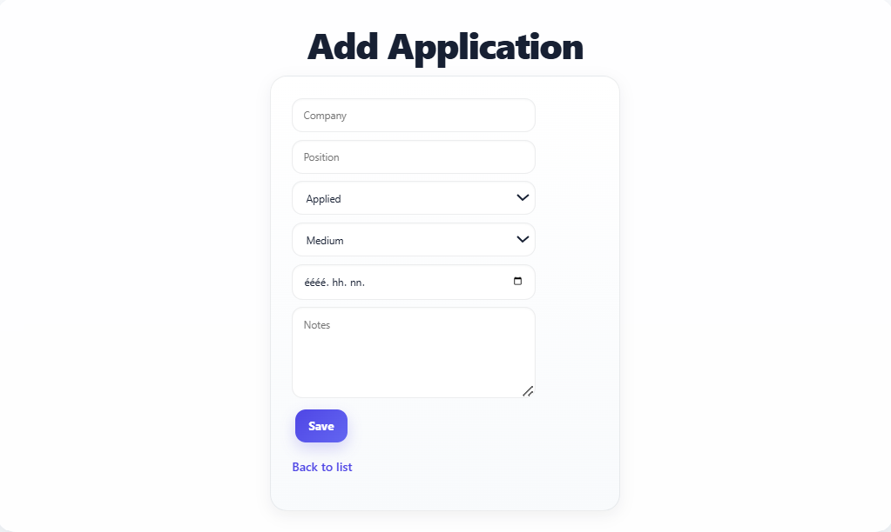
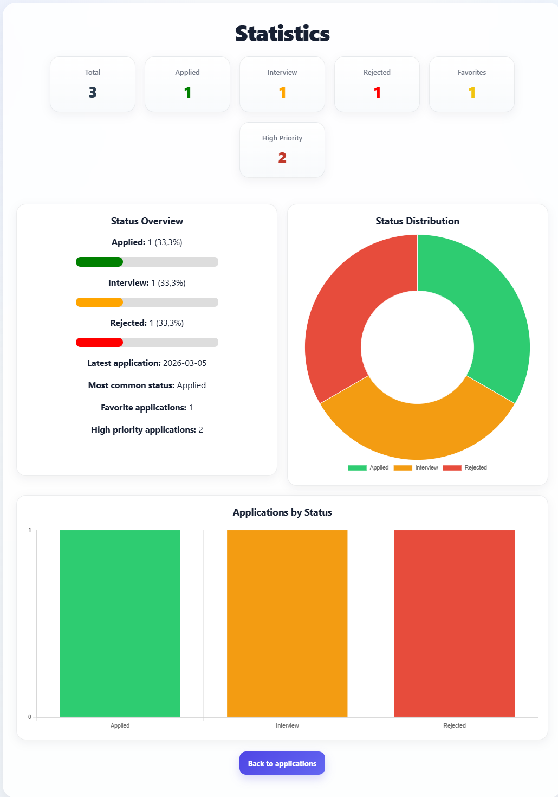
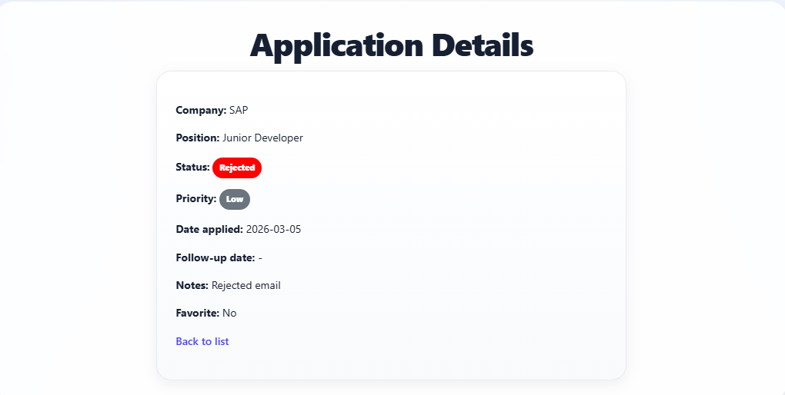
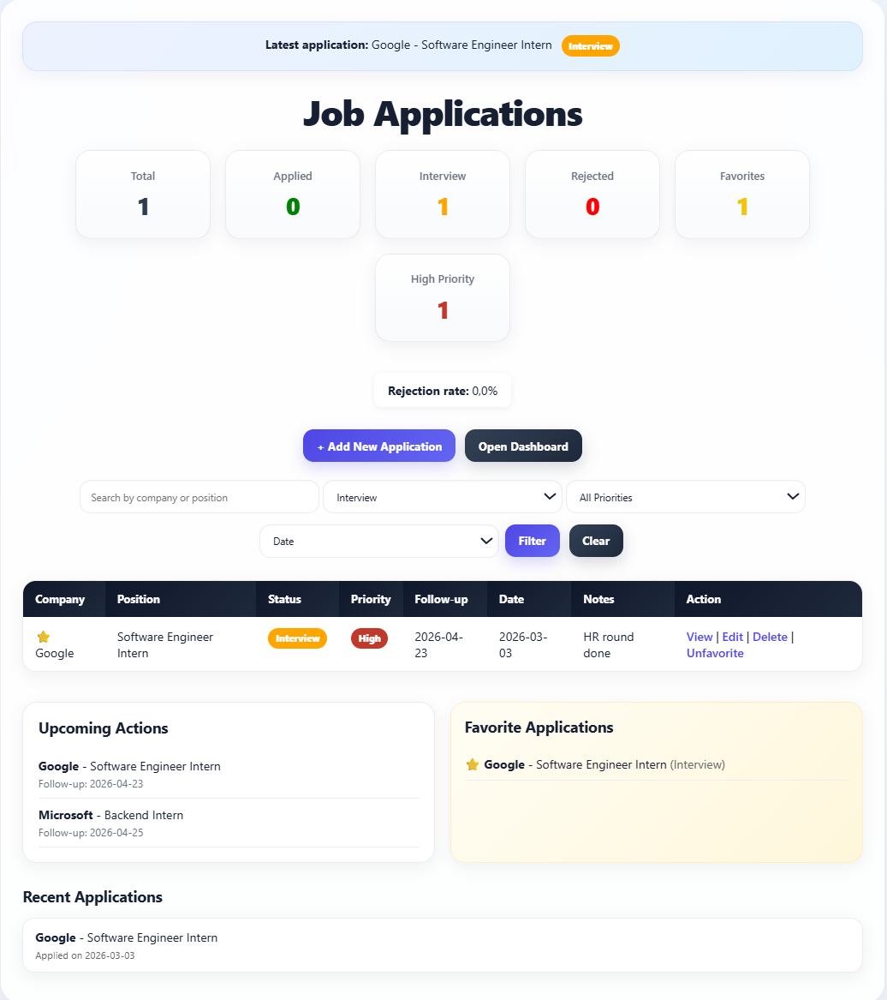

# CareerTrack


A web application for tracking job and internship applications, built with **F# and ASP.NET Core**.

> Track, analyze and manage your job applications in one place.

---

## Live Demo

 https://careertrack-e5rg.onrender.com

---

## About the Project

CareerTrack is a simple but powerful application designed to help manage job applications efficiently.

It provides filtering, searching, and statistics to give users better insight into their application process.

The goal of the project was to go beyond basic CRUD functionality and build a more complete and user-friendly experience.

---

## Features

- Add, edit and delete job applications
- Search by company, position or notes
- Filter by status (Applied, Interview, Rejected)
- Filter by priority (Low, Medium, High)
- Mark applications as favorites ⭐
- Track follow-up dates
- Sort applications (date, company, priority)
- View statistics dashboard

---

## Extra Features

- Favorites system
- Dashboard cards (total, applied, rejected, etc.)
- Recent applications panel
- Upcoming actions (follow-up tracking)
- Rejection rate calculation
- Most common status detection
- Highlight latest application

---

## UX Highlights

- Clean and modern UI design
- Color-coded status indicators
- Fast filtering and search
- Responsive layout
- Dashboard-style overview
- Visual charts for statistics

---

## Tech Stack

- F#
- ASP.NET Core (Minimal API)
- .NET 9
- HTML & CSS
- Chart.js
- Docker
- Render (deployment)

---

## Screenshots

Applications Page


Add Application


Statistics Dashboard


Application Details


Filtering Example


Applications Page


Add Application


Statistics Dashboard


---

## Getting Started (Local)

```bash
git clone https://github.com/elekvk/careertrack.git
cd careertrack
dotnet run